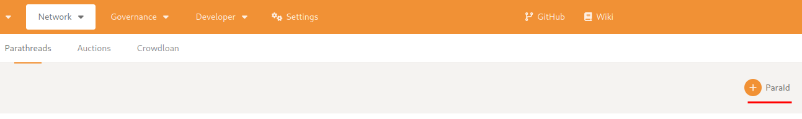

* Generate a plain chainspec:
```
./target/release/parachain-template-node build-spec --disable-default-bootnode > plain-chainspec.json
```

* Visit the [relay chain app](https://polkadot.js.org/apps/?rpc=wss://sub0-oz-workshop.duckdns.org/websocket#/explorer) and register the parachain id. For that go to “Network” > “Parachains” > “Parathread” tab and click the “+ ParaId” button. Save the suggested id.



* Edit your chainspec. Open the previously generated plain-chainspec.json and make the following changes:
```
{
  "name": "Local Testnet", # change name to any unique value
  "id": "local_testnet", # change id to any unique value
...
  "protocolId": "template-local", # change protocolId to any unique value
...
  "para_id": 1000, # change para_id
...
  "parachainInfo": {
    "parachainId": 1000 # change parachainId
  },
}
```

* Generate a raw chainspec:
```
./target/release/parachain-template-node build-spec --raw --chain plain-chainspec.json > raw-chainspec.json
```